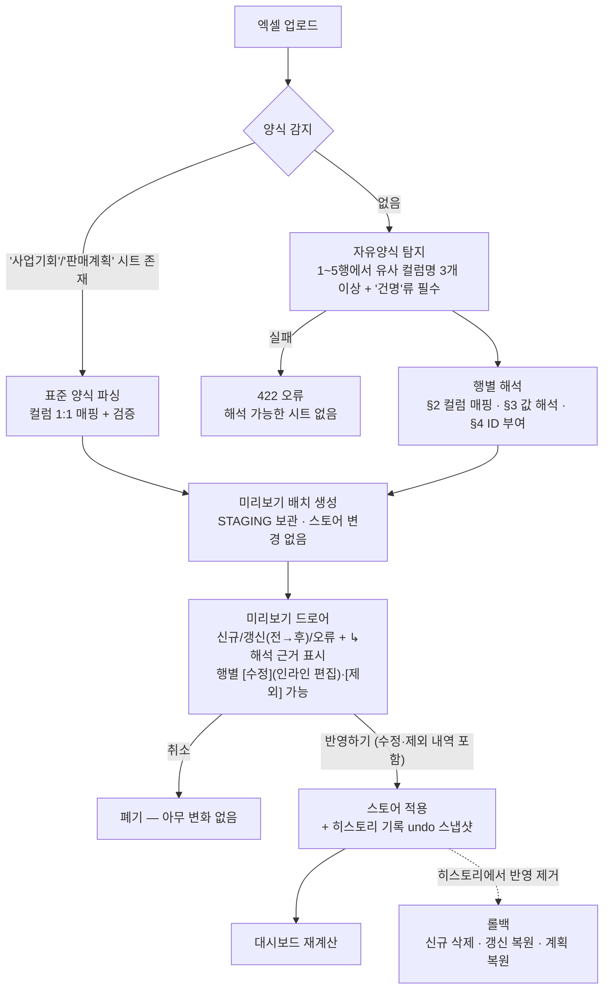
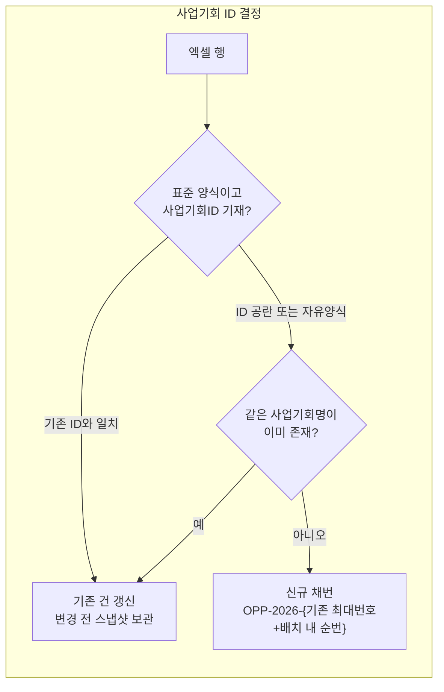

# 엑셀 업로드 변환 로직 — 무엇이 어떻게 바뀌는가

`excel/field_sample.xlsx`(현업 자유양식)가 플랫폼 표준 스키마로 변환되는 전 과정을 설명한다.
표준 양식(`sales_pipeline_template.xlsx`)은 컬럼이 1:1이라 해석 단계 없이 검증만 거친다.

## 1. 전체 파이프라인

핵심: **업로드 시점에는 아무것도 반영되지 않는다.** 해석 결과가 미리보기(STAGING)에만 존재하고,
[반영하기]를 눌러야 스토어에 들어가며, 그 시점의 undo 스냅샷으로 언제든 되돌릴 수 있다.

## 2. 컬럼 매핑 — 유사어 사전

원본 헤더가 아래 유사어 중 하나면 해당 내부 필드로 인식한다. (제목행은 건너뛰고 1~5행에서 헤더 행을 탐색)

| 내부 필드 | 인식하는 원본 컬럼명 | field_sample에서 |
|---|---|---|
| `name` 사업기회명 | 건명, 사업명, 안건, 내용, 프로젝트 | "건명" |
| `accountName` 고객사 | 업체명, 업체, 거래처(명), 고객사(명), 고객명, 기관명 | "업체명" |
| `productModel` 모델 | 품목/모델, 품목, 모델, 제품(명), 장비 | "품목/모델" |
| `quantity` 수량 | 수량, 대수 | "수량" |
| `amount` 금액 | 예상금액, 금액, 수주예상액, 규모, 금액(백만) 등 | "예상금액" |
| `stage` 단계 | 진행상태, 상태, 진행(단계), 진척 | "진행상태" |
| `closeDate` 수주예정일 | 수주예정(일), 납기, 예정일, 수주시기 | "수주예정" |
| `owner` 담당 | 담당(자), 영업담당 | "담당" |
| `description` 비고 | 비고, 메모, 특이사항, 코멘트 | "비고" |

인식되지 않는 컬럼(예: "순번")은 무시된다.

## 3. 값 해석 규칙

| 항목 | 규칙 | 예시 |
|---|---|---|
| **금액** | ①`N억`→×1억 ②`N백만/천만` 접미 ③헤더에 '백만' 표기 ④콤마 숫자→원 그대로 ⑤단위 없는 10만 미만 숫자→백만원 단위로 추정(노트 표시) | `0.9억`→90,000,000 / `270`→270,000,000 / `45,000,000`→그대로 |
| **단계** | 용어 사전 매칭 → 표준 7단계, 확도 자동 부여 | `견적 제출`→제안·견적(50%) / `상담중`→니즈 파악·상담(25%) / `데모 예정`→Demo·PoC/테스트(65%) / `리드`→리드 발굴(10%) |
| **날짜** | `YYYY.MM.DD`·`YYYY/MM/DD`→정규화, `MM/DD`→2026년 가정, `N월말/초/중순`→말일/5일/15일 | `11월말`→2026-11-30 / `12/15`→2026-12-15. 미기재 시 2026-12-31 가정(노트) |
| **사업부** | 품목·건명 키워드로 추정 — 프린터 계열 키워드를 최우선 검사(모델명 부분 문자열 오탐 방지) | `복합기`→PRT / `프로젝터·EB-`→PJT / `로봇·SCARA·GX8`→RBT / `분말·헤드`→CMP / 무매칭→PRT |
| **채널·파트너** | ①비고/건명에 '총판' 언급 → 총판 + `총판(파트너명)` 패턴에서 파트너 추출 ②기존 계정 매칭 시 계정의 채널 계승 ③둘 다 아니면 직판 가정 | 비고 "총판(P총판상사) 경유" → 채널 총판·파트너 P총판상사 |

모든 추정·해석은 미리보기의 **"↳ 해석:"** 줄에 근거와 함께 표시된다. 해석이 틀린 경우 두 가지 방법이 있다:
1. **행별 [수정]** — 승격 폼처럼 미리보기에서 직접 사업부·채널·단계·금액·수주일·담당·파트너사를 고쳐서 반영 (단계 변경 시 확도 자동 재계산)
2. **행별 [제외]** — 이번 반영에서 해당 행만 빼기 ([되살리기]로 복구 가능)
수정·제외 내역은 [반영하기] 시점에 서버로 전달되어 검증 후 적용된다.

## 4. ID 매핑 — 가장 궁금해하실 부분

- **신규 채번**: 스토어의 기존 최대 번호(예: OPP-2026-0024) 다음부터 배치 내 순서대로 부여
  → field_sample 5행이 OPP-2026-**0025~0029**를 받는 이유. **미리보기 단계에서 이미 확정**되어 화면에 표시된다.
- **갱신 판정**: 표준 양식은 사업기회ID로, 자유양식은 정규화된 사업기회명("업체명 건명")이 완전히 같을 때만.
  이름이 조금이라도 다르면 신규로 들어간다(중복 위험보다 데이터 유실 위험을 낮게 본 보수적 선택).
- **계정 ID 매칭** (accountId): 3단계 — ①정확 일치 ②괄호 제거 후 일치("A제조" = "A제조(반도체 후공정)") ③포함 관계.
  매칭되면 계정의 채널·고객유형을 계승하고 상세 패널에서 설치베이스가 연결된다. 실패하면 accountId 없이 이름만 보존(신규 업체).

## 5. field_sample.xlsx 실제 변환 트레이스

| 원본 행 | → 변환 결과 | 해석 노트 |
|---|---|---|
| A제조 · 후공정 검사실 복합기 추가 · WF-C879R · `0.9억` · 견적 제출 · 2026.10.31 | **OPP-2026-0025** · PRT/직판 · 9천만원 · 제안·견적(50%) · ACC-0001 연결 | 억 단위 해석 · 계정 유사매칭(괄호 제거) |
| H호텔체인 · 프린터 표준화 · `45,000,000` · 상담중 · 11월말 · 비고 "총판(P총판상사) 경유" | **OPP-2026-0026** · PRT/**총판·P총판상사** · 4.5천만원 · 니즈 파악·상담(25%) · 2026-11-30 | 비고에서 채널·파트너 추출 · 월말 해석 |
| C전자부품 · 로봇 신규 라인 · GX8 · `270` · 데모 예정 · 12/15 | **OPP-2026-0027** · RBT/직판 · 2.7억 · Demo·PoC/테스트(65%) · ACC-0005 연결 | 백만원 단위 추정 · 연도 2026 가정 |
| 서울OO도서관 · 프로젝터 · EB-770F · `0.4억` · 견적 제출 | **OPP-2026-0028** · PJT/직판 · 4천만원 · 제안·견적(50%) | 품목 기반 PJT 추정 · 신규 업체 |
| K팩토리 · 라벨프린터 증설 · `28,000,000` · 리드 · 12월말 | **OPP-2026-0029** · PRT/직판 · 2.8천만원 · 리드 발굴(10%) | 신규 업체 → 직판 가정 |

## 6. 반영 후 "비는" 데이터 — 정직한 한계

**원본 엑셀에 없는 정보는 만들어내지 않는다.** 자유양식 업로드 건은 반영 후 아래 필드가 공란이다:

| 상태 | 필드 |
|---|---|
| ✅ 원본에서 채워짐 | 사업기회명, 고객사, 모델, 수량, 금액, 단계, 수주예정일, 담당, 비고 |
| 🔵 규칙으로 추정(노트 표시) | 사업부, 채널, 파트너사(비고 힌트 시), 확도(단계 기본값), 계정ID |
| ⚪ **공란으로 남음** | 제품군, 고객 Pain Point, 요구 조건(Target Spec), Demo·PoC/QUAL 목표, 경쟁사, 관련 사업기회 |

공란 필드는 상세 패널에서 해당 섹션이 표시되지 않는 것으로 확인할 수 있고, 이후 ①표준 양식으로 같은 ID를
재업로드해 갱신하거나 ②(향후) 화면에서 직접 편집으로 보완하는 흐름을 상정한다. 비고에 적힌 서술 정보는
텍스트로는 보존되지만(Pain Point성 내용 포함) 구조화되지는 않는다 — 이 지점이 향후 LLM 매핑을 붙일 자리다
(비고 문장에서 Pain Point/경쟁사/스펙 추출).

## 7. 롤백 시 되돌아가는 것

히스토리에서 [반영 제거] 시, 반영 시점에 저장한 undo 스냅샷으로 복원한다:
신규 건 → 삭제 · 갱신 건 → 업로드 이전 레코드 전체로 복원 · 판매계획 → 이전 금액(신규 행이었다면 행 삭제).
같은 건을 여러 배치가 연달아 수정한 경우, 나중 배치를 먼저 제거하는 것(역순 롤백)을 권장한다.
