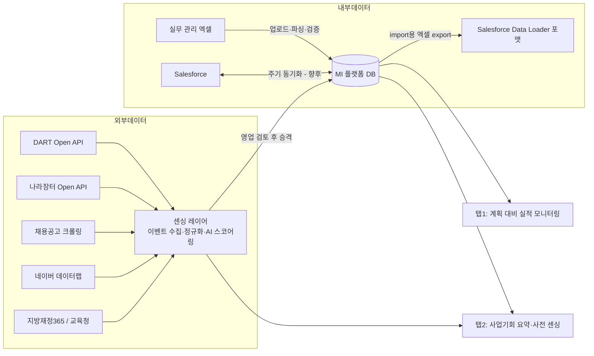

# Epson Korea MI 플랫폼 설계서 (v0.1 Draft)

> 작성일: 2026-07-29 · 상태: 설계 초안 (Salesforce 실연동 전, 예시 데이터 기반)

---

## 1. 개요

### 1.1 목적

- **대상**: Epson Korea 본사 (사업부: 프린터 / 프로젝터 / 로봇 / 부품·소재)
- **목표**:
  1. Salesforce 데이터 기반 **판매 계획 대비 실적 모니터링**
  2. 외부 공개 데이터(DART·나라장터·채용공고 등) 기반 **AI 사전 센싱 및 사업기회 탐색**
- **핵심 pain-point 대응**: 실무진이 관리하는 엑셀의 "셀포화 부담"을 줄이기 위해
  **엑셀 업로드 → 플랫폼 자동 반영 + Salesforce import용 엑셀 export** 양방향 지원

### 1.2 사용자

| 사용자 | 주요 사용 시나리오 |
|---|---|
| 영업 실무자 | 엑셀 업로드/다운로드, 본인 담당 사업기회 현황 확인, 센싱 이벤트 검토·승격 |
| 팀장/사업부장 | 사업부·채널별 계획 대비 실적, 파이프라인 점검, 승격 승인 |
| 경영진 | 전사 KPI 요약, 사업부별 달성률, 신규 기회 규모 |

### 1.3 전체 데이터 흐름



**설계 원칙 — 2단계 승격 구조**: 외부 이벤트는 Salesforce에 바로 넣지 않는다.
센싱 레이어에서 수집·스코어링된 이벤트를 영업이 검토하여 **유효 건만 Salesforce Lead/사업기회로 승격**한다.
(근거: 외부 이벤트는 노이즈 비율이 높고 계정 매칭이 불확실하여, 전량 셀포화 시 데이터 품질 저하 및 실무진 관리 부담이 오히려 증가)

---

## 2. 데이터 목록 및 구조

### 2.1 데이터 소스 총괄

| # | 데이터 | 소스 | 접근방식 | 갱신주기(안) | 사용 탭 |
|---|---|---|---|---|---|
| 1 | 사업기회(Opportunity) | Salesforce / 엑셀 업로드 | API·파일 | 일 1회 + 수시 | 탭1·탭2 |
| 2 | 계정(Account) | Salesforce / 엑셀 업로드 | API·파일 | 일 1회 | 탭1·탭2 |
| 3 | 판매 계획 | 엑셀 업로드 (연 1회 + 수정분) | 파일 | 수시 | 탭1 |
| 4 | 계약/매출인식 | Salesforce (Contract·자체 오브젝트) | API | 일 1회 | 탭1 |
| 5 | DART 공시 이벤트 | DART Open API | API | 일 1회 | 탭2 |
| 6 | 나라장터 입찰공고·낙찰 | 조달청 Open API | API | 일 1회 | 탭2 |
| 7 | 채용정보 | 고용24(워크넷) Open API 기본 + 사람인 공식 API 보조 | API | 주 1회 | 탭2 |
| 8 | ~~검색량 추이~~ | ~~네이버 데이터랩 API~~ | — | — | **제외** (약관상 저장·재가공 불허 — docs/DATA_SOURCE_FEASIBILITY.md) |
| 9 | 지자체·교육청 예산 | 지방재정365 / 열린재정 | API·다운로드 | 월 1회 | 탭2 |
| 10 | ~~교육청 개별 입찰공고~~ | ~~각 교육청 웹 게시~~ | — | — | **제외** (크롤링 구현·운영 부담 대비 효용 낮음 — 나라장터 API로 대부분 커버) |

### 2.2 조직·기간 축 (집계 기준)

- **조직 축**: 사업부(4) × 채널(직판/총판) → 담당 영업 드릴다운
  - 사업부 코드: `PRT`(프린터·복합기·MPS), `PJT`(프로젝터·디스플레이), `RBT`(로봇), `CMP`(부품·소재: 잉크젯 헤드/반도체/금속분말)
- **기간 축**: **연간 목표 + 월별 진척률** 기본. 필터로 월/분기/연 전환. 판매 계획은 월 단위 입력, 분기·연은 롤업.

### 2.3 사업기회(Opportunity) 스키마 — Salesforce 필드 가정

> Epson Korea의 실제 셀포 항목을 모르는 상태의 **가정 스키마**. 표준 필드 + 커스텀 필드(`__c`)로 구성.
> 참고용으로 받은 반도체 장비사 관리 항목(Fab/공정/Pain Point/Target Spec/Demo·QUAL 목표)을 Epson 사업 특성에 맞게 변형.

| 필드 (플랫폼 키) | Salesforce API명(가정) | 타입 | 필수 | 설명 |
|---|---|---|---|---|
| 사업기회ID | `Id` | ID | 자동 | OPP-YYYY-#### |
| 사업기회명 | `Name` | Text | ✔ | 예: "OO교육청 프로젝터 300대 교체" |
| 고객사(계정) | `AccountId` | Lookup | ✔ | Account 참조 |
| 사업부 | `BusinessUnit__c` | Picklist | ✔ | PRT/PJT/RBT/CMP |
| 채널 | `Channel__c` | Picklist | ✔ | 직판/총판 (총판인 경우 파트너사명 별도) |
| 파트너사 | `PartnerAccount__c` | Lookup | | 총판 채널일 때 |
| 고객유형 | `CustomerSegment__c` | Picklist | | B2B기업/B2G공공/B2B2C리테일 |
| 제품군 | `ProductFamily__c` | Picklist | ✔ | 예: 산업용 잉크젯, 레이저 프로젝터, SCARA 로봇 … |
| 대표 모델 | `ProductModel__c` | Text | | 예: WF-C21000, EB-PU2220B, GX8-B |
| 예상 수량 | `Quantity__c` | Number | | 대수/유닛 |
| 예상 금액(원) | `Amount` | Currency | ✔ | 총 계약 예상 금액 |
| 단계 | `StageName` | Picklist | ✔ | 2.4 단계 정의 참조 |
| 확도(%) | `Probability` | Percent | 자동 | 단계 매핑 기본값, 수동 조정 허용 |
| 예상 수주일 | `CloseDate` | Date | ✔ | |
| 고객 Pain Point | `PainPoint__c` | LongText | | 예: 기존 램프 프로젝터 밝기 저하, TCO 부담 |
| 요구 조건(Target Spec) | `TargetSpec__c` | LongText | | 예: 밝기 4,000루멘 이상 / A/S 3년 |
| Demo·PoC 목표 | `DemoTargetDate__c` | Date | | 장비·로봇 등 실증 필요 사업 |
| 검증(QUAL) 목표 | `QualTargetDate__c` | Date | | 부품·소재(CMP) 사업부용 |
| 경쟁사 | `Competitor__c` | Text | | |
| 관련 사업기회 | `RelatedOpportunity__c` | Lookup | | 유사·파생 기회 연결 |
| 유입 경로 | `LeadSource` | Picklist | | 기존고객/전시회/**MI센싱** 등 — 승격 건 추적 키 |
| 원천 센싱 이벤트 | `SensingEventId__c` | Text | | 승격된 경우 EVT-ID 역참조 |
| 담당 영업 | `OwnerId` | Lookup | ✔ | |
| 비고 | `Description` | LongText | | |

**계정(Account) 주요 필드(가정)**: 계정ID, 계정명, 업종, 규모(대/중소), 채널귀속, 담당영업 +
**설치베이스**(모델, 설치수량, 도입일, 유지보수 만기일, 교체주기) — 설치베이스는 계정 하위 별도 테이블(1:N) 권장.

### 2.4 영업 단계 정의 (가정 — Epson 확인 필요)

| 순서 | 단계 | 기본 확도 | 탭1 집계 구분 |
|---|---|---|---|
| 1 | 리드 발굴 | 10% | 진행 중 |
| 2 | 니즈 파악·상담 | 25% | 진행 중 |
| 3 | 제안·견적 | 50% | 진행 중 |
| 4 | Demo·PoC/테스트 | 65% | 진행 중 |
| 5 | 협상·계약검토 | 80% | 진행 중 |
| 6 | 계약 완료(수주) | 100% | 계약완료 |
| 7 | 매출 인식 | — | 매출인식 (검수/납품 완료 기준, 확인 필요) |
| × | 실주(Lost) | 0% | 제외 (실주 사유 분석용 별도 표시) |

### 2.5 판매 계획 테이블

| 필드 | 타입 | 설명 |
|---|---|---|
| 연도 | Number | 예: 2026 |
| 월 | Number | 1~12 (월 단위 입력, 분기·연은 롤업) |
| 사업부 | Picklist | PRT/PJT/RBT/CMP |
| 채널 | Picklist | 직판/총판 |
| 목표 금액(원) | Currency | |
| 담당 조직/팀 | Text | 옵션 (조직 확정 후) |

### 2.6 엑셀 ↔ Salesforce 양방향 변환

**업로드(엑셀 → 플랫폼)** — 두 가지 양식 지원
- **표준 양식**: `excel/sales_pipeline_template.xlsx`의 "사업기회"/"판매계획" 시트
- **현업 자유양식**: 컬럼명 유사어 매핑(업체명/거래처→고객사 등), 금액 단위 해석('0.9억'·백만원 숫자·콤마 원), 단계 용어 변환('견적 제출'→제안·견적), 날짜 표기 해석('11월말'·'12/15'), 품목 기반 사업부 추정, 계정 유사 매칭 — 해석 내역을 미리보기에 표시하고 [반영] 승인 후 적용, 히스토리에서 롤백 가능
1. 업로드 파일 파싱
2. 검증: 필수값 누락, 사업부·단계·채널 코드값 여부, 금액·날짜 형식, 사업기회ID 중복(있으면 update, 없으면 신규)
3. 검증 통과분은 모니터링 DB에 즉시 반영, 오류 행은 오류 리포트로 반환

**Export(플랫폼 → Salesforce import용 엑셀)**
- Salesforce Data Loader / Import Wizard 호환 포맷으로 변환하여 다운로드
- 컬럼 헤더를 API 필드명으로 치환, 코드값 매핑(예: 단계 한글명 → StageName 값), 날짜 `YYYY-MM-DD` 통일
- 매핑 규칙은 `excel/salesforce_import_sample.xlsx`의 "매핑표" 시트에 정의 (실무컬럼명 ↔ API명 1:1)

### 2.7 외부 센싱 이벤트 — 통합 스키마

B2B(DART·채용·검색량)와 B2G(입찰·예산)를 **하나의 이벤트 모델**로 통합하고,
소스 특화 정보는 `상세속성(JSON)`으로 확장하는 구조를 권장한다.
(이유: 탭2 피드/스코어링/승격 워크플로는 공통이고, 소스별 원본 필드는 이질적이기 때문)

**공통 필드**

| 필드 | 타입 | 설명 |
|---|---|---|
| 이벤트ID | Text | EVT-YYYY-#### |
| 구분 | Picklist | B2B / B2G |
| 트리거유형 | Picklist | 2.8 분류체계 참조 |
| 이벤트일자 | Date | 공시일/공고일/게시일 |
| 대상기관·기업명 | Text | 원문 기재 명칭 |
| 매칭 계정ID | Lookup | 기존 Account 매칭 성공 시 (신규면 공란) |
| 이벤트 요약 | LongText | 수집 원문 요약 |
| 출처 | Text | DART API / 나라장터 API / 사람인 크롤링 … |
| 원문 URL | URL | |
| 신뢰도 | Picklist | 상/중/하 (소스 구조화 정도 + 내용 명확성) |
| 관련 사업부(추정) | Picklist | PRT/PJT/RBT/CMP — AI 분류 |
| 관련 제품군(추정) | Text | AI 분류 |
| 잠재 규모(예상) | Number+단위 | 대수 또는 금액 |
| AI 스코어 | 1~5 | 2.9 산식 |
| 상태 | Picklist | 신규 → 검토중 → **승격**(→사업기회ID 연결) / 기각 / 보류(재모니터링) |
| 승격 사업기회ID | Lookup | 승격 시 생성된 Opportunity 역참조 |
| 담당 영업(배정) | Text | 검토 담당 |
| 상세속성 | JSON | 소스별 확장 필드 (아래) |

**상세속성 예 — B2G 입찰(`bid`)**: 공고ID, 발주기관, 품목, 입찰마감일, 낙찰일, 낙찰업체, 낙찰가, 낙찰률, 계약방식, 규격서 주요조건, **경쟁사 스펙락인 여부**
**상세속성 예 — B2B 공시(`dart`)**: 공시유형(설비투자/유상증자/신규시설), 투자금액, 공시 원문번호
**상세속성 예 — 채용(`job`)**: 채용 직무, 인원 규모, 신규 거점 여부
**상세속성 예 — 예산(`budget`)**: 회계연도, 예산 과목, 편성액, 집행 시기(추정)

### 2.8 트리거유형 분류체계 (초안 — 구체화 필요)

| 코드 | 트리거유형 | 주요 소스 | 신호 의미 (예) |
|---|---|---|---|
| TRG-01 | 설비투자·증설 공시 | DART | 생산라인 증설 → 산업용 잉크젯/로봇 수요 |
| TRG-02 | 신축·이전·거점 확대 | DART·채용 | 사무동 신축 → 복합기·MPS 수요 |
| TRG-03 | 채용 확대(조직 성장) | 채용정보 API | 매장·인력 확대 → POS·영수증프린터 |
| TRG-04 | 가맹점·매장 확대 | 채용정보 API·보도 | 신규 매장 N개 → 리테일 채널 기회 |
| TRG-05 | 입찰 공고(신규) | 나라장터·교육청 | 직접 참여 가능 기회 |
| TRG-06 | 낙찰 결과(경쟁 동향) | 나라장터 | 경쟁사 수주 → 차기 재입찰 대비 |
| TRG-07 | 예산 편성 | 지방재정365 | 차년도 조달 수요 선행 신호 |
| TRG-08 | 유지보수 만기 도래 | 내부 설치베이스 | 만기 6개월 전 알림 → 갱신·교체 제안 |
| TRG-09 | 교체주기 도래 | 내부 설치베이스 | 도입일+교체주기 임박 |
| TRG-10 | ~~검색량 급증~~ | ~~네이버 데이터랩~~ | **제외** — 약관상 축적 불가, 필요 시 NCP 유료 API 계약 후 재도입 |

> TRG-08·09는 외부 수집이 아닌 **내부 설치베이스 파생 이벤트**지만, 동일 파이프라인에 태워 탭2 피드에서 함께 관리한다.

### 2.9 AI 사전 센싱 스코어(1~5) 산식 초안

```
스코어 = round( 0.30×신뢰도 + 0.30×잠재규모 + 0.25×시급성 + 0.15×설치베이스 연관성 ) → 1~5 정규화
```

| 요소 | 산정 기준(안) |
|---|---|
| 신뢰도 | 소스 구조화 정도(상=5/중=3/하=1) × 내용 명확성 보정 |
| 잠재규모 | 예상 대수·금액을 사업부별 기준 구간으로 5분위화 |
| 시급성 | 입찰마감일·만기일·집행시기까지 잔여일 (짧을수록 높음) |
| 설치베이스 연관성 | 기존 고객 매칭 + 자사 설치 모델 존재 시 가점 |

> 초기에는 룰 기반으로 시작하고, 승격/기각 이력이 쌓이면 학습 기반으로 고도화. 가중치는 운영 데이터로 튜닝 필요.

---

## 3. 지표·그래프 정의

### 3.1 탭1 — 판매 계획 대비 실적 모니터링

| # | 컴포넌트 | 형태 | 정의 |
|---|---|---|---|
| 1-A | KPI 카드 ×4 | 숫자 카드 | ① 판매 계획 ② 진행 중 사업기회 ③ 계약완료 ④ 매출인식 — 각 금액(억원) + 계획 대비 % (②는 확도가중 금액 병기 옵션) |
| 1-B | 단계별 파이프라인 | 가로 단계 바(퍼널) | 단계 1~5 가로 배열, 각 단계에 `x건 / xx억` 표기. 클릭 시 1-E 테이블 해당 단계 필터 |
| 1-C | 월별 계획 vs 실적 | 콤보 차트 (막대=월 실적, 선=누적 계획/누적 실적) | X축 1~12월, Y축 금액. "실적" 기준은 계약완료/매출인식 토글 |
| 1-D | 사업부×채널 달성률 | 히트맵 (4행×2열) | 셀 값 = 달성률 %, 색상 3단계(≥100 / 70~99 / <70) |
| 1-E | 사업기회별 현황 | 테이블 | 2.3 스키마 주요 컬럼. 필터(사업부·채널·단계·담당), 정렬, 검색, 행 클릭 시 상세 패널 |

- 공통 필터: **기간(연도 기본, 월/분기 전환) · 사업부 · 채널 · 담당 영업** — 모든 컴포넌트에 일괄 적용
- KPI 정의: 계획=판매계획 합계, 진행중=단계1~5 Amount 합, 계약완료=당기 수주 합, 매출인식=당기 인식 합

### 3.2 탭2 — 사업기회 요약 (사전 센싱)

| # | 컴포넌트 | 형태 | 정의 |
|---|---|---|---|
| 2-A | 센싱 요약 카드 ×4 | 숫자 카드 | ① 신규 이벤트(기간 내) ② 검토중 ③ 승격(→사업기회 전환) ④ 고스코어(4점↑) 미처리 |
| 2-B | 이벤트 피드 | 카드 리스트 (스코어 내림차순) | 트리거유형 아이콘 + 기관명 + 요약 + 스코어 + 상태. 카드에서 바로 [승격/기각/보류] 액션 |
| 2-C | 트리거유형·소스 분포 | 가로 막대 | 기간 내 이벤트 건수 분포 — 수집 편중 확인용 |
| 2-D | 승격 퍼널 | 퍼널 차트 | 수집 → 검토 → 승격 → 수주 (전환율 %) — 센싱 ROI 측정 |
| 2-E | 이벤트 타임라인 (B2B·B2G) | 간트+포인트 | B2G 입찰은 공고일→마감일 막대(D-7 강조), B2B 이벤트는 발생 시점 마커. 행 클릭 시 상세 패널 |
| 2-F | 경쟁사 낙찰 동향 | 테이블 | 낙찰업체·낙찰가·낙찰률·스펙락인 여부 — 재입찰 전략 수립용 |

- 공통 필터: 기간 · 구분(B2B/B2G) · 트리거유형 · 사업부(추정) · 상태 · 스코어
- **승격 액션 동작**: 이벤트 → 사업기회 생성 폼(이벤트 내용 자동 프리필: 계정, 제품군, 잠재규모→예상금액, LeadSource=MI센싱) → 저장 시 탭1 파이프라인 단계1로 진입 + 이벤트 상태 "승격" 처리

---

## 4. UI 초안 (레이아웃)

### 4.0 공통 헤더

```
┌──────────────────────────────────────────────────────────────────────────┐
│  EPSON KOREA MI Platform        [탭1 계획대비실적] [탭2 사업기회 요약]      │
│  기간:[2026 ▾][연간|분기|월]  사업부:[전체 ▾]  채널:[전체 ▾]  담당:[전체 ▾] │
│                                  [⬆ 엑셀 업로드]  [⬇ Salesforce용 Export] │
└──────────────────────────────────────────────────────────────────────────┘
```

### 4.1 탭1 — 판매 계획 대비 실적 모니터링

```
┌──────────────┬──────────────┬──────────────┬──────────────┐
│ 판매 계획      │ 진행중 기회    │ 계약완료       │ 매출 인식      │
│  320억        │  185억(42건)  │  118억(37%)   │   96억(30%)   │  ← 1-A KPI
└──────────────┴──────────────┴──────────────┴──────────────┘
┌──────────────────────────────────────────────────────────────┐
│ 단계별 진행중 사업기회                                    1-B │
│ [리드발굴]→[니즈파악]→[제안·견적]→[Demo·PoC]→[협상]           │
│  12건/38억   9건/41억   8건/52억    7건/33억   6건/21억       │
└──────────────────────────────────────────────────────────────┘
┌───────────────────────────────┬──────────────────────────────┐
│ 월별 계획 vs 실적 (콤보)   1-C │ 사업부×채널 달성률 히트맵 1-D │
│  ▂▄▆▅▇… + 누적선              │  PRT PJT RBT CMP × 직판/총판  │
└───────────────────────────────┴──────────────────────────────┘
┌──────────────────────────────────────────────────────────────┐
│ 사업기회별 현황 테이블                                    1-E │
│ 필터[사업부|채널|단계|담당]  검색[    ]                        │
│ ID|사업기회명|고객사|사업부|채널|모델|금액|단계|확도|수주예정|담당 │
│ …rows… (행 클릭 → 우측 상세 패널: Pain Point/Spec/Demo목표 등) │
└──────────────────────────────────────────────────────────────┘
```

### 4.2 탭2 — 사업기회 요약 (사전 센싱)

```
┌──────────────┬──────────────┬──────────────┬──────────────┐
│ 신규 이벤트    │ 검토중        │ 승격          │ 고스코어 미처리 │  ← 2-A
│  24건         │  11건        │  6건(→기회)    │  5건 ⚠        │
└──────────────┴──────────────┴──────────────┴──────────────┘
┌──────────────────────────────────┬───────────────────────────┐
│ 센싱 이벤트 피드 (스코어순)   2-B │ 트리거유형·소스 분포   2-C │
│ ┌──────────────────────────────┐ │  설비투자공시 ████ 8       │
│ │⚙ A제조 | 설비투자공시 | ★4    │ │  입찰공고    ███ 6        │
│ │ 신규 라인 증설 승인…          │ │  채용확대    ██ 4         │
│ │ [승격][기각][보류]            │ ├───────────────────────────┤
│ └──────────────────────────────┘ │ 승격 퍼널             2-D │
│ ┌──────────────────────────────┐ │  수집24→검토11→승격6→수주2 │
│ │…                             │ └───────────────────────────┘
└──────────────────────────────────┴───────────────────────────┘
┌──────────────────────────────────────────────────────────────┐
│ B2G 입찰 타임라인 (공고→마감, D-7 강조)                   2-E │
└──────────────────────────────────────────────────────────────┘
┌───────────────────────────────┬──────────────────────────────┐
│ 경쟁사 낙찰 동향 테이블    2-F │ 검색량 추이 (데이터랩)    2-G │
└───────────────────────────────┴──────────────────────────────┘
```

---

## 5. 추가 정의 필요 사항 (Open Questions)

| # | 항목 | 내용 | 확인 대상 |
|---|---|---|---|
| 1 | 실제 Salesforce 단계·필드 | 현행 StageName 값, 커스텀 필드, 레코드타입 유무 | Epson SFDC 관리자 |
| 2 | 매출인식 기준 | 수주 시점 vs 납품/검수 시점, 셀포 내 관리 오브젝트 | 재무·영업기획 |
| 3 | 조직 체계 | 사업부·팀 실제 명칭, 총판 파트너 목록 | 영업기획 |
| 4 | 현행 엑셀 양식 | 실무진이 쓰는 실제 엑셀 컬럼 확보 → 템플릿 조정 | 영업 실무 |
| 5 | 채용공고 크롤링 적법성 | 사람인·잡코리아 이용약관/robots.txt 검토, 필요 시 제휴·API 대체 | 법무 |
| 6 | 트리거유형 확정 | 2.8 초안의 사업부별 유효 트리거 검증, 키워드 사전 구축 | 영업·기획 워크숍 |
| 7 | 스코어 가중치 | 2.9 산식의 가중치·구간 기준 초기값 합의 | 영업기획 |
| 8 | 승격 시 셀포 생성 방식 | API 자동 생성 vs export 파일 수동 import, 권한·중복 정책 | SFDC 관리자 |
| 9 | 계정 매칭 규칙 | 외부 이벤트 기관명 ↔ Account 매칭(사업자번호? 명칭 유사도?) | 데이터 담당 |
| 10 | 확도가중 파이프라인 표기 | KPI ②를 단순 합계로 할지 확도가중(Amount×Probability)으로 할지 | 경영진 리포팅 기준 |
| 11 | 알림 정책 | 고스코어 이벤트·입찰 마감 임박 알림 채널(메일/메신저)·주기 | 실무 |
| 12 | 데이터 보존·이력 | 이벤트 원문 보존 기간, 사업기회 단계 변경 이력 추적 여부 | IT |

---

## 6. 예시 데이터 파일 안내

| 파일 | 내용 |
|---|---|
| `data/sample/opportunities.json` | 사업기회 15건 (4개 사업부 × 직판/총판, 전 단계 분포) |
| `data/sample/accounts.json` | 계정 8건 + 설치베이스 |
| `data/sample/sales_plan.json` | 2026년 사업부×채널×월 판매 계획 |
| `data/sample/sensing_events.json` | 외부 센싱 이벤트 10건 (B2B/B2G, 상세속성 포함) |
| `excel/sales_pipeline_template.xlsx` | 실무 관리용 엑셀 (사업기회·판매계획·입력가이드 시트) |
| `excel/salesforce_import_sample.xlsx` | Salesforce import용 변환 결과 + 매핑표 |
